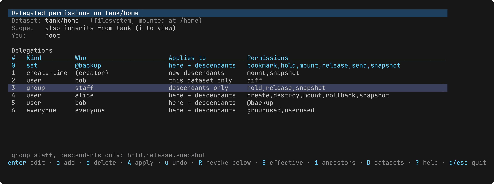
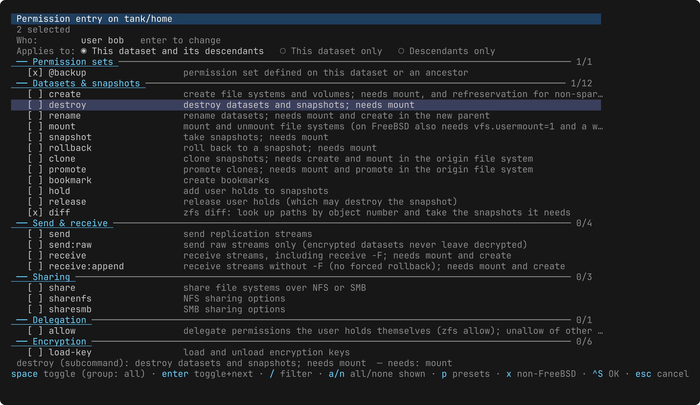

# zfs-allow

A terminal UI and scripting front-end for ZFS delegated administration —
`zfs allow` / `zfs unallow` — for FreeBSD. Sibling of
[facl](https://github.com/olgeni/facl), same look and feel.

`zfs allow` has a hundred permissions, five kinds of entries (users, groups,
everyone, create-time, permission sets), three scopes (`-l`, `-d`, neither)
and a syntax that is easy to get subtly wrong. zfs-allow shows the
delegations of a dataset the way `zfs allow` prints them, lets you edit them
as a checklist with every permission described, and then shows you the exact
`zfs allow` / `zfs unallow` commands that turn the current state into the
edited one before running them — with pre-flight warnings for the things
that only bite later (`create` without `mount`, `vfs.usermount=0`, a mount
point the user cannot write to, what an unprivileged delegator cannot do).

## Install

    go install github.com/olgeni/zfs-allow@latest

or `git clone … && go build`. The man page is `zfs-allow.1`; shell
completions for zsh, bash and fish are in `completions/`.

## Interactive

    zfs-allow [dataset]

Without a dataset a picker lists every file system and volume, with the
dataset of the current directory preselected; `q`/`esc` from the dataset
return to the picker.

Main screen: one row per entry (permission sets, create-time permissions,
then the grants in `zfs allow` order), the ancestors that also delegate to
this dataset (`i`), and what the current user can do here (`You:` line).

| key | |
|---|---|
| enter, e | edit the entry |
| a | add a grant / create-time permissions / a permission set |
| d | delete the entry |
| R | revoke the entry here and on every descendant (`zfs unallow -r`) |
| A | apply: preview the commands and pre-flight notes, then run them |
| u | undo · r reload |
| E | effective permissions of a user here (own, groups, everyone, ancestors, sets expanded — with sources) |
| i | the ancestors' delegations |
| D | switch dataset |
| ? / h | help / keys |

Editor: who (enter picks a user, a group or everyone), scope (this dataset
and descendants / this dataset only / descendants only), then the
permissions grouped as in zfs-allow(8) with a one-line description each.
`/` filters by name or description, space toggles (on a group header: the
whole group), `a`/`n` select all/none of what is shown, `p` loads a preset
bundle (snapshots, backup, replication-target, datasets, properties, quotas,
everything), `x` shows the permissions FreeBSD refuses (`mlslabel`,
`zoned`).

## Scripting

    zfs-allow -list [-json] [dataset]
    zfs-allow -add WHO -perms P,… [-scope both|local|descendants] [-n|-y|-check] [dataset]
    zfs-allow -remove WHO [-perms P,…] [-scope S] [-r] [-n|-y|-check] [dataset]
    zfs-allow -effective USER [-json] [dataset]
    zfs-allow -where WHO [-json]
    zfs-allow -dump [-r] [dataset] > F
    zfs-allow -restore F [-n|-y|-check]
    zfs-allow -catalogue [-json]

`WHO` is `user:NAME`, `group:NAME`, `everyone`, `@SET` (defines/changes a
permission set) or `create-time`. `-perms` takes catalogue names, `@SET`s and
`+PRESET`s. `-r` with `-remove` is `zfs unallow -r` (the dataset and every
descendant); with `-dump` it includes the descendants. `-n` prints the
commands, `-check` exits 3 if anything would change (for configuration
management), `-y` applies without asking. The dataset defaults to the one
the current directory is on; a path on a ZFS file system (`.`,
`/usr/local/etc`) stands for the dataset holding it.

    $ zfs-allow -add user:bob -perms +snapshots,send -n tank/home/bob
    zfs allow -u bob bookmark,destroy,diff,hold,mount,release,rollback,send,snapshot tank/home/bob
    note: vfs.usermount is 0: unprivileged users cannot mount, so mount and everything that needs it … will fail — sysctl vfs.usermount=1

    # zfs-allow -dump -r tank/home > delegations.json
    # zfs-allow -restore delegations.json -check || zfs-allow -restore delegations.json -y

## Things it knows that the man page does not say loudly

- `zfs allow` prints a *derived* view: each user/group/everyone really has
  two sets, local and descendent; `Local+Descendent` is their intersection.
  The editor keeps that model, so granting `-l hold` to someone who already
  has `hold` on both simply disappears into the `Local+Descendent` line —
  exactly as the kernel sees it.
- Entries are ordered by the string form of the numeric id
  (`"0" < "20" < "5"`), not by name. zfs-allow reproduces that order.
- An unprivileged user with the `allow` permission can delegate what they
  hold, but can `zfs unallow` only their own entries and cannot define
  permission sets — root is needed for those. The pre-flight says so before
  you try.
- Delegations never override the mount point: to create file systems a user
  also needs to create directories in the parent's mount point (`chown`, or
  an NFSv4 ACL with `add_subdirectory` — facl).
- Unknown uids print as `user (unknown: 12345)`; zfs-allow keeps working
  with the numeric id.
- `mlslabel` and `zoned` are refused on FreeBSD ("operation not applicable
  to datasets of this type" — the same message an unknown name gets).

## Tests

    go test ./...

The parser is pinned by a golden `zfs allow` output taken on FreeBSD 15 /
OpenZFS 2.4. Everything else (diff, effective, preflight, the editor and the
pickers) is pure and tested without a pool.

## License

BSD 2-clause.
